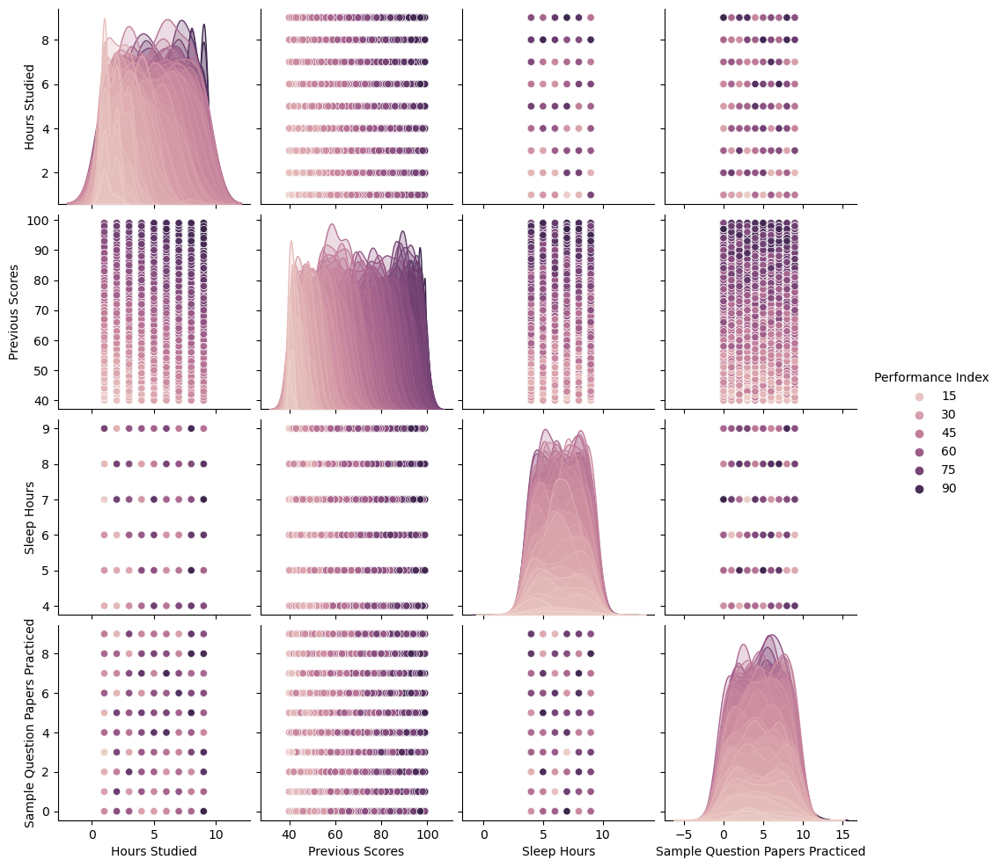

```python
import numpy as np
import pandas as pd
import matplotlib.pyplot as plt
import seaborn as sns
```


```python
data = pd.read_csv("Student_Performance.csv")
```


```python
data
```


<div>
<style scoped>
    .dataframe tbody tr th:only-of-type {
        vertical-align: middle;
    }

    .dataframe tbody tr th {
        vertical-align: top;
    }

    .dataframe thead th {
        text-align: right;
    }
</style>
<table border="1" class="dataframe">
  <thead>
    <tr style="text-align: right;">
      <th></th>
      <th>Hours Studied</th>
      <th>Previous Scores</th>
      <th>Extracurricular Activities</th>
      <th>Sleep Hours</th>
      <th>Sample Question Papers Practiced</th>
      <th>Performance Index</th>
    </tr>
  </thead>
  <tbody>
    <tr>
      <th>0</th>
      <td>7</td>
      <td>99</td>
      <td>Yes</td>
      <td>9</td>
      <td>1</td>
      <td>91.0</td>
    </tr>
    <tr>
      <th>1</th>
      <td>4</td>
      <td>82</td>
      <td>No</td>
      <td>4</td>
      <td>2</td>
      <td>65.0</td>
    </tr>
    <tr>
      <th>2</th>
      <td>8</td>
      <td>51</td>
      <td>Yes</td>
      <td>7</td>
      <td>2</td>
      <td>45.0</td>
    </tr>
    <tr>
      <th>3</th>
      <td>5</td>
      <td>52</td>
      <td>Yes</td>
      <td>5</td>
      <td>2</td>
      <td>36.0</td>
    </tr>
    <tr>
      <th>4</th>
      <td>7</td>
      <td>75</td>
      <td>No</td>
      <td>8</td>
      <td>5</td>
      <td>66.0</td>
    </tr>
    <tr>
      <th>...</th>
      <td>...</td>
      <td>...</td>
      <td>...</td>
      <td>...</td>
      <td>...</td>
      <td>...</td>
    </tr>
    <tr>
      <th>9995</th>
      <td>1</td>
      <td>49</td>
      <td>Yes</td>
      <td>4</td>
      <td>2</td>
      <td>23.0</td>
    </tr>
    <tr>
      <th>9996</th>
      <td>7</td>
      <td>64</td>
      <td>Yes</td>
      <td>8</td>
      <td>5</td>
      <td>58.0</td>
    </tr>
    <tr>
      <th>9997</th>
      <td>6</td>
      <td>83</td>
      <td>Yes</td>
      <td>8</td>
      <td>5</td>
      <td>74.0</td>
    </tr>
    <tr>
      <th>9998</th>
      <td>9</td>
      <td>97</td>
      <td>Yes</td>
      <td>7</td>
      <td>0</td>
      <td>95.0</td>
    </tr>
    <tr>
      <th>9999</th>
      <td>7</td>
      <td>74</td>
      <td>No</td>
      <td>8</td>
      <td>1</td>
      <td>64.0</td>
    </tr>
  </tbody>
</table>
<p>10000 rows × 6 columns</p>
</div>


```python
sns.pairplot(data , hue = 'Performance Index')
```

    C:\Users\motal\anaconda3\Lib\site-packages\seaborn\axisgrid.py:118: UserWarning: The figure layout has changed to tight
      self._figure.tight_layout(*args, **kwargs)
    


    <seaborn.axisgrid.PairGrid at 0x2063706f650>


    

    


```python
from sklearn.preprocessing import LabelEncoder
```


```python
Encoder = LabelEncoder()
```


```python
data['Extracurricular Activities'] = Encoder.fit_transform(data['Extracurricular Activities'])
```


```python
data
```


<div>
<style scoped>
    .dataframe tbody tr th:only-of-type {
        vertical-align: middle;
    }

    .dataframe tbody tr th {
        vertical-align: top;
    }

    .dataframe thead th {
        text-align: right;
    }
</style>
<table border="1" class="dataframe">
  <thead>
    <tr style="text-align: right;">
      <th></th>
      <th>Hours Studied</th>
      <th>Previous Scores</th>
      <th>Extracurricular Activities</th>
      <th>Sleep Hours</th>
      <th>Sample Question Papers Practiced</th>
      <th>Performance Index</th>
    </tr>
  </thead>
  <tbody>
    <tr>
      <th>0</th>
      <td>7</td>
      <td>99</td>
      <td>1</td>
      <td>9</td>
      <td>1</td>
      <td>91.0</td>
    </tr>
    <tr>
      <th>1</th>
      <td>4</td>
      <td>82</td>
      <td>0</td>
      <td>4</td>
      <td>2</td>
      <td>65.0</td>
    </tr>
    <tr>
      <th>2</th>
      <td>8</td>
      <td>51</td>
      <td>1</td>
      <td>7</td>
      <td>2</td>
      <td>45.0</td>
    </tr>
    <tr>
      <th>3</th>
      <td>5</td>
      <td>52</td>
      <td>1</td>
      <td>5</td>
      <td>2</td>
      <td>36.0</td>
    </tr>
    <tr>
      <th>4</th>
      <td>7</td>
      <td>75</td>
      <td>0</td>
      <td>8</td>
      <td>5</td>
      <td>66.0</td>
    </tr>
    <tr>
      <th>...</th>
      <td>...</td>
      <td>...</td>
      <td>...</td>
      <td>...</td>
      <td>...</td>
      <td>...</td>
    </tr>
    <tr>
      <th>9995</th>
      <td>1</td>
      <td>49</td>
      <td>1</td>
      <td>4</td>
      <td>2</td>
      <td>23.0</td>
    </tr>
    <tr>
      <th>9996</th>
      <td>7</td>
      <td>64</td>
      <td>1</td>
      <td>8</td>
      <td>5</td>
      <td>58.0</td>
    </tr>
    <tr>
      <th>9997</th>
      <td>6</td>
      <td>83</td>
      <td>1</td>
      <td>8</td>
      <td>5</td>
      <td>74.0</td>
    </tr>
    <tr>
      <th>9998</th>
      <td>9</td>
      <td>97</td>
      <td>1</td>
      <td>7</td>
      <td>0</td>
      <td>95.0</td>
    </tr>
    <tr>
      <th>9999</th>
      <td>7</td>
      <td>74</td>
      <td>0</td>
      <td>8</td>
      <td>1</td>
      <td>64.0</td>
    </tr>
  </tbody>
</table>
<p>10000 rows × 6 columns</p>
</div>


1='Yes' 

0 = 'No'


```python
data.isna().sum()
```


    Hours Studied                       0
    Previous Scores                     0
    Extracurricular Activities          0
    Sleep Hours                         0
    Sample Question Papers Practiced    0
    Performance Index                   0
    dtype: int64


```python
data_corr =  data.corr()
```


```python
data_corr
```


<div>
<style scoped>
    .dataframe tbody tr th:only-of-type {
        vertical-align: middle;
    }

    .dataframe tbody tr th {
        vertical-align: top;
    }

    .dataframe thead th {
        text-align: right;
    }
</style>
<table border="1" class="dataframe">
  <thead>
    <tr style="text-align: right;">
      <th></th>
      <th>Hours Studied</th>
      <th>Previous Scores</th>
      <th>Extracurricular Activities</th>
      <th>Sleep Hours</th>
      <th>Sample Question Papers Practiced</th>
      <th>Performance Index</th>
    </tr>
  </thead>
  <tbody>
    <tr>
      <th>Hours Studied</th>
      <td>1.000000</td>
      <td>-0.012390</td>
      <td>0.003873</td>
      <td>0.001245</td>
      <td>0.017463</td>
      <td>0.373730</td>
    </tr>
    <tr>
      <th>Previous Scores</th>
      <td>-0.012390</td>
      <td>1.000000</td>
      <td>0.008369</td>
      <td>0.005944</td>
      <td>0.007888</td>
      <td>0.915189</td>
    </tr>
    <tr>
      <th>Extracurricular Activities</th>
      <td>0.003873</td>
      <td>0.008369</td>
      <td>1.000000</td>
      <td>-0.023284</td>
      <td>0.013103</td>
      <td>0.024525</td>
    </tr>
    <tr>
      <th>Sleep Hours</th>
      <td>0.001245</td>
      <td>0.005944</td>
      <td>-0.023284</td>
      <td>1.000000</td>
      <td>0.003990</td>
      <td>0.048106</td>
    </tr>
    <tr>
      <th>Sample Question Papers Practiced</th>
      <td>0.017463</td>
      <td>0.007888</td>
      <td>0.013103</td>
      <td>0.003990</td>
      <td>1.000000</td>
      <td>0.043268</td>
    </tr>
    <tr>
      <th>Performance Index</th>
      <td>0.373730</td>
      <td>0.915189</td>
      <td>0.024525</td>
      <td>0.048106</td>
      <td>0.043268</td>
      <td>1.000000</td>
    </tr>
  </tbody>
</table>
</div>


```python
corcoef = np.corrcoef(data)
```


```python
corcoef
```


    array([[1.        , 0.99512489, 0.99774132, ..., 0.99903373, 0.998786  ,
            0.99882631],
           [0.99512489, 1.        , 0.99465156, ..., 0.99717963, 0.990335  ,
            0.99701023],
           [0.99774132, 0.99465156, 1.        , ..., 0.9967519 , 0.99615704,
            0.99933778],
           ...,
           [0.99903373, 0.99717963, 0.9967519 , ..., 1.        , 0.99659692,
            0.99846865],
           [0.998786  , 0.990335  , 0.99615704, ..., 0.99659692, 1.        ,
            0.99615267],
           [0.99882631, 0.99701023, 0.99933778, ..., 0.99846865, 0.99615267,
            1.        ]])


```python
x=data.iloc[: , :-1]
```


```python
x
```


<div>
<style scoped>
    .dataframe tbody tr th:only-of-type {
        vertical-align: middle;
    }

    .dataframe tbody tr th {
        vertical-align: top;
    }

    .dataframe thead th {
        text-align: right;
    }
</style>
<table border="1" class="dataframe">
  <thead>
    <tr style="text-align: right;">
      <th></th>
      <th>Hours Studied</th>
      <th>Previous Scores</th>
      <th>Extracurricular Activities</th>
      <th>Sleep Hours</th>
      <th>Sample Question Papers Practiced</th>
    </tr>
  </thead>
  <tbody>
    <tr>
      <th>0</th>
      <td>7</td>
      <td>99</td>
      <td>1</td>
      <td>9</td>
      <td>1</td>
    </tr>
    <tr>
      <th>1</th>
      <td>4</td>
      <td>82</td>
      <td>0</td>
      <td>4</td>
      <td>2</td>
    </tr>
    <tr>
      <th>2</th>
      <td>8</td>
      <td>51</td>
      <td>1</td>
      <td>7</td>
      <td>2</td>
    </tr>
    <tr>
      <th>3</th>
      <td>5</td>
      <td>52</td>
      <td>1</td>
      <td>5</td>
      <td>2</td>
    </tr>
    <tr>
      <th>4</th>
      <td>7</td>
      <td>75</td>
      <td>0</td>
      <td>8</td>
      <td>5</td>
    </tr>
    <tr>
      <th>...</th>
      <td>...</td>
      <td>...</td>
      <td>...</td>
      <td>...</td>
      <td>...</td>
    </tr>
    <tr>
      <th>9995</th>
      <td>1</td>
      <td>49</td>
      <td>1</td>
      <td>4</td>
      <td>2</td>
    </tr>
    <tr>
      <th>9996</th>
      <td>7</td>
      <td>64</td>
      <td>1</td>
      <td>8</td>
      <td>5</td>
    </tr>
    <tr>
      <th>9997</th>
      <td>6</td>
      <td>83</td>
      <td>1</td>
      <td>8</td>
      <td>5</td>
    </tr>
    <tr>
      <th>9998</th>
      <td>9</td>
      <td>97</td>
      <td>1</td>
      <td>7</td>
      <td>0</td>
    </tr>
    <tr>
      <th>9999</th>
      <td>7</td>
      <td>74</td>
      <td>0</td>
      <td>8</td>
      <td>1</td>
    </tr>
  </tbody>
</table>
<p>10000 rows × 5 columns</p>
</div>


```python
y = data.iloc[: , -1]
```


```python
y
```


    0       91.0
    1       65.0
    2       45.0
    3       36.0
    4       66.0
            ... 
    9995    23.0
    9996    58.0
    9997    74.0
    9998    95.0
    9999    64.0
    Name: Performance Index, Length: 10000, dtype: float64


```python
y.shape
```


    (10000,)


```python
from sklearn.preprocessing import MinMaxScaler
```


```python
x_scl = MinMaxScaler().fit_transform(x)
```


```python
x_scl
```


    array([[0.75      , 1.        , 1.        , 1.        , 0.11111111],
           [0.375     , 0.71186441, 0.        , 0.        , 0.22222222],
           [0.875     , 0.18644068, 1.        , 0.6       , 0.22222222],
           ...,
           [0.625     , 0.72881356, 1.        , 0.8       , 0.55555556],
           [1.        , 0.96610169, 1.        , 0.6       , 0.        ],
           [0.75      , 0.57627119, 0.        , 0.8       , 0.11111111]])


```python
from sklearn.preprocessing import PolynomialFeatures
```


```python
x_scl_poly = PolynomialFeatures().fit_transform(x_scl)
```


```python
x_scl_poly
```


    array([[1.        , 0.75      , 1.        , ..., 1.        , 0.11111111,
            0.01234568],
           [1.        , 0.375     , 0.71186441, ..., 0.        , 0.        ,
            0.04938272],
           [1.        , 0.875     , 0.18644068, ..., 0.36      , 0.13333333,
            0.04938272],
           ...,
           [1.        , 0.625     , 0.72881356, ..., 0.64      , 0.44444444,
            0.30864198],
           [1.        , 1.        , 0.96610169, ..., 0.36      , 0.        ,
            0.        ],
           [1.        , 0.75      , 0.57627119, ..., 0.64      , 0.08888889,
            0.01234568]])


```python
from sklearn.model_selection import train_test_split
```


```python
x_train , x_test , y_train , y_test = train_test_split(x_scl_poly , y , test_size=0.3 ,shuffle=True)
```


```python
print(x_train.shape)
print(y_train.shape)
print(x_test.shape)
print(y_test.shape)
```

    (7000, 21)
    (7000,)
    (3000, 21)
    (3000,)
    


```python
from sklearn.linear_model import LinearRegression
```


```python
reg = LinearRegression()
```


```python
reg.fit(x_train , y_train)
```


<style>#sk-container-id-3 {color: black;}#sk-container-id-3 pre{padding: 0;}#sk-container-id-3 div.sk-toggleable {background-color: white;}#sk-container-id-3 label.sk-toggleable__label {cursor: pointer;display: block;width: 100%;margin-bottom: 0;padding: 0.3em;box-sizing: border-box;text-align: center;}#sk-container-id-3 label.sk-toggleable__label-arrow:before {content: "▸";float: left;margin-right: 0.25em;color: #696969;}#sk-container-id-3 label.sk-toggleable__label-arrow:hover:before {color: black;}#sk-container-id-3 div.sk-estimator:hover label.sk-toggleable__label-arrow:before {color: black;}#sk-container-id-3 div.sk-toggleable__content {max-height: 0;max-width: 0;overflow: hidden;text-align: left;background-color: #f0f8ff;}#sk-container-id-3 div.sk-toggleable__content pre {margin: 0.2em;color: black;border-radius: 0.25em;background-color: #f0f8ff;}#sk-container-id-3 input.sk-toggleable__control:checked~div.sk-toggleable__content {max-height: 200px;max-width: 100%;overflow: auto;}#sk-container-id-3 input.sk-toggleable__control:checked~label.sk-toggleable__label-arrow:before {content: "▾";}#sk-container-id-3 div.sk-estimator input.sk-toggleable__control:checked~label.sk-toggleable__label {background-color: #d4ebff;}#sk-container-id-3 div.sk-label input.sk-toggleable__control:checked~label.sk-toggleable__label {background-color: #d4ebff;}#sk-container-id-3 input.sk-hidden--visually {border: 0;clip: rect(1px 1px 1px 1px);clip: rect(1px, 1px, 1px, 1px);height: 1px;margin: -1px;overflow: hidden;padding: 0;position: absolute;width: 1px;}#sk-container-id-3 div.sk-estimator {font-family: monospace;background-color: #f0f8ff;border: 1px dotted black;border-radius: 0.25em;box-sizing: border-box;margin-bottom: 0.5em;}#sk-container-id-3 div.sk-estimator:hover {background-color: #d4ebff;}#sk-container-id-3 div.sk-parallel-item::after {content: "";width: 100%;border-bottom: 1px solid gray;flex-grow: 1;}#sk-container-id-3 div.sk-label:hover label.sk-toggleable__label {background-color: #d4ebff;}#sk-container-id-3 div.sk-serial::before {content: "";position: absolute;border-left: 1px solid gray;box-sizing: border-box;top: 0;bottom: 0;left: 50%;z-index: 0;}#sk-container-id-3 div.sk-serial {display: flex;flex-direction: column;align-items: center;background-color: white;padding-right: 0.2em;padding-left: 0.2em;position: relative;}#sk-container-id-3 div.sk-item {position: relative;z-index: 1;}#sk-container-id-3 div.sk-parallel {display: flex;align-items: stretch;justify-content: center;background-color: white;position: relative;}#sk-container-id-3 div.sk-item::before, #sk-container-id-3 div.sk-parallel-item::before {content: "";position: absolute;border-left: 1px solid gray;box-sizing: border-box;top: 0;bottom: 0;left: 50%;z-index: -1;}#sk-container-id-3 div.sk-parallel-item {display: flex;flex-direction: column;z-index: 1;position: relative;background-color: white;}#sk-container-id-3 div.sk-parallel-item:first-child::after {align-self: flex-end;width: 50%;}#sk-container-id-3 div.sk-parallel-item:last-child::after {align-self: flex-start;width: 50%;}#sk-container-id-3 div.sk-parallel-item:only-child::after {width: 0;}#sk-container-id-3 div.sk-dashed-wrapped {border: 1px dashed gray;margin: 0 0.4em 0.5em 0.4em;box-sizing: border-box;padding-bottom: 0.4em;background-color: white;}#sk-container-id-3 div.sk-label label {font-family: monospace;font-weight: bold;display: inline-block;line-height: 1.2em;}#sk-container-id-3 div.sk-label-container {text-align: center;}#sk-container-id-3 div.sk-container {/* jupyter's `normalize.less` sets `[hidden] { display: none; }` but bootstrap.min.css set `[hidden] { display: none !important; }` so we also need the `!important` here to be able to override the default hidden behavior on the sphinx rendered scikit-learn.org. See: https://github.com/scikit-learn/scikit-learn/issues/21755 */display: inline-block !important;position: relative;}#sk-container-id-3 div.sk-text-repr-fallback {display: none;}</style><div id="sk-container-id-3" class="sk-top-container"><div class="sk-text-repr-fallback"><pre>LinearRegression()</pre><b>In a Jupyter environment, please rerun this cell to show the HTML representation or trust the notebook. <br />On GitHub, the HTML representation is unable to render, please try loading this page with nbviewer.org.</b></div><div class="sk-container" hidden><div class="sk-item"><div class="sk-estimator sk-toggleable"><input class="sk-toggleable__control sk-hidden--visually" id="sk-estimator-id-3" type="checkbox" checked><label for="sk-estimator-id-3" class="sk-toggleable__label sk-toggleable__label-arrow">LinearRegression</label><div class="sk-toggleable__content"><pre>LinearRegression()</pre></div></div></div></div></div>


```python
print("The Training Performance is:" , reg.score(x_train , y_train)*100 , "%")
```

    The Training Performance is: 98.87822236584431 %
    


```python
preds = reg.predict(x_test)
```


```python
preds
```


    array([63.8049017 , 64.5134932 , 84.83960736, ..., 77.03045947,
           49.12306188, 52.07930478])


```python
print("The Test Performance is:" , reg.score(x_test , y_test)*100 , "%")
```

    The Test Performance is: 98.87086000356577 %
    

The Model Training Well

# Test The Model In Real Life


```python
preinput = ([[7,99,1,9,1]])
```


```python
preinput_Scl = MinMaxScaler().fit_transform(preinput)
```


```python
poly_preinput_Scl = PolynomialFeatures().fit_transform(preinput_Scl)
```


```python
poly_preinput_Scl
```


    array([[1., 0., 0., 0., 0., 0., 0., 0., 0., 0., 0., 0., 0., 0., 0., 0.,
            0., 0., 0., 0., 0.]])


```python
result = reg.predict(poly_preinput_Scl)
```


```python
result
```


    array([11.67765362])


```python
Hours_Studied = input("Enter Hours Studied : ")
Previous_Scores = input("Enter Previous Scores: ")
Extracurricular_Activities = input("Enter Extracurricular Activities: ")
Sleep_Hours = input("Enter Sleep Hours: ")
Sample_Question_Papers_Practiced = input("Enter Sample Question Papers Practiced: ")
```

    Enter Hours Studied : 10
    Enter Previous Scores: 7
    Enter Extracurricular Activities: 1
    Enter Sleep Hours: 8
    Enter Sample Question Papers Practiced: 3
    


```python
inputs = ([[Hours_Studied ,Previous_Scores,Extracurricular_Activities,Sleep_Hours , Sample_Question_Papers_Practiced ]])
```


```python
Scaled_Input = MinMaxScaler().fit_transform(inputs)
```


```python
Poly_Inputs_Scaled  = PolynomialFeatures().fit_transform(Scaled_Input)
```


```python
Final_Result = reg.predict(Poly_Inputs_Scaled)
```


```python
print("The Prediction Performance Index is :" ,Final_Result)
```

    The Prediction Performance Index is : [11.67765362]
    

# Population_Test_DataSet is :  
    
    A Random DataSet Given To Evaluate The Model In Real Life  


```python
pulation_Test = pd.read_csv("Population_test.csv")
```


```python
pulation_Test
```


<div>
<style scoped>
    .dataframe tbody tr th:only-of-type {
        vertical-align: middle;
    }

    .dataframe tbody tr th {
        vertical-align: top;
    }

    .dataframe thead th {
        text-align: right;
    }
</style>
<table border="1" class="dataframe">
  <thead>
    <tr style="text-align: right;">
      <th></th>
      <th>Hours Studied</th>
      <th>Previous Scores</th>
      <th>Extracurricular Activities</th>
      <th>Sleep Hours</th>
      <th>Sample Question Papers Practiced</th>
    </tr>
  </thead>
  <tbody>
    <tr>
      <th>0</th>
      <td>7</td>
      <td>99</td>
      <td>1</td>
      <td>9</td>
      <td>1</td>
    </tr>
    <tr>
      <th>1</th>
      <td>4</td>
      <td>82</td>
      <td>0</td>
      <td>4</td>
      <td>2</td>
    </tr>
    <tr>
      <th>2</th>
      <td>8</td>
      <td>51</td>
      <td>1</td>
      <td>7</td>
      <td>2</td>
    </tr>
    <tr>
      <th>3</th>
      <td>5</td>
      <td>52</td>
      <td>1</td>
      <td>5</td>
      <td>2</td>
    </tr>
    <tr>
      <th>4</th>
      <td>7</td>
      <td>75</td>
      <td>0</td>
      <td>8</td>
      <td>5</td>
    </tr>
    <tr>
      <th>...</th>
      <td>...</td>
      <td>...</td>
      <td>...</td>
      <td>...</td>
      <td>...</td>
    </tr>
    <tr>
      <th>105</th>
      <td>1</td>
      <td>76</td>
      <td>0</td>
      <td>8</td>
      <td>5</td>
    </tr>
    <tr>
      <th>106</th>
      <td>1</td>
      <td>82</td>
      <td>0</td>
      <td>4</td>
      <td>6</td>
    </tr>
    <tr>
      <th>107</th>
      <td>5</td>
      <td>61</td>
      <td>1</td>
      <td>6</td>
      <td>6</td>
    </tr>
    <tr>
      <th>108</th>
      <td>3</td>
      <td>90</td>
      <td>1</td>
      <td>7</td>
      <td>7</td>
    </tr>
    <tr>
      <th>109</th>
      <td>4</td>
      <td>63</td>
      <td>1</td>
      <td>5</td>
      <td>3</td>
    </tr>
  </tbody>
</table>
<p>110 rows × 5 columns</p>
</div>


```python
Population_Scaled = MinMaxScaler().fit_transform(pulation_Test)
```


```python
Population_Scaled
```


    array([[0.75      , 1.        , 1.        , 1.        , 0.11111111],
           [0.375     , 0.71186441, 0.        , 0.        , 0.22222222],
           [0.875     , 0.18644068, 1.        , 0.6       , 0.22222222],
           [0.5       , 0.20338983, 1.        , 0.2       , 0.22222222],
           [0.75      , 0.59322034, 0.        , 0.8       , 0.55555556],
           [0.25      , 0.6440678 , 0.        , 1.        , 0.66666667],
           [0.75      , 0.55932203, 1.        , 0.2       , 0.66666667],
           [0.875     , 0.08474576, 1.        , 0.        , 0.66666667],
           [0.5       , 0.62711864, 0.        , 0.8       , 0.22222222],
           [0.375     , 0.83050847, 0.        , 0.        , 0.        ],
           [0.875     , 0.86440678, 0.        , 0.        , 0.55555556],
           [0.875     , 0.66101695, 0.        , 0.4       , 0.22222222],
           [0.25      , 0.11864407, 0.        , 1.        , 0.22222222],
           [0.625     , 0.11864407, 0.        , 0.        , 0.22222222],
           [0.5       , 0.66101695, 0.        , 0.6       , 0.88888889],
           [0.125     , 0.54237288, 0.        , 0.        , 0.33333333],
           [0.875     , 0.55932203, 1.        , 0.8       , 0.44444444],
           [0.625     , 0.72881356, 1.        , 0.6       , 0.22222222],
           [0.125     , 0.23728814, 1.        , 0.        , 1.        ],
           [0.5       , 0.59322034, 0.        , 0.6       , 0.        ],
           [0.        , 1.        , 1.        , 0.        , 0.33333333],
           [0.625     , 0.94915254, 0.        , 1.        , 0.        ],
           [1.        , 0.57627119, 1.        , 0.6       , 0.66666667],
           [0.        , 0.76271186, 0.        , 0.2       , 0.66666667],
           [0.25      , 0.3559322 , 0.        , 0.4       , 0.33333333],
           [0.75      , 0.37288136, 1.        , 0.6       , 0.44444444],
           [0.375     , 0.66101695, 0.        , 0.8       , 1.        ],
           [1.        , 0.74576271, 1.        , 0.4       , 0.66666667],
           [1.        , 0.96610169, 1.        , 0.8       , 0.55555556],
           [0.875     , 0.88135593, 1.        , 0.        , 0.77777778],
           [0.5       , 0.40677966, 1.        , 0.4       , 0.22222222],
           [0.125     , 0.40677966, 1.        , 0.4       , 0.55555556],
           [0.5       , 0.81355932, 0.        , 0.2       , 0.22222222],
           [0.875     , 0.33898305, 0.        , 0.        , 0.77777778],
           [1.        , 0.13559322, 0.        , 0.        , 0.33333333],
           [1.        , 0.91525424, 0.        , 1.        , 0.11111111],
           [0.        , 0.79661017, 1.        , 0.8       , 0.88888889],
           [1.        , 0.62711864, 0.        , 1.        , 1.        ],
           [0.75      , 0.3559322 , 1.        , 0.        , 0.77777778],
           [1.        , 0.71186441, 1.        , 0.2       , 0.55555556],
           [0.875     , 0.37288136, 1.        , 0.        , 0.22222222],
           [0.        , 0.81355932, 1.        , 1.        , 0.11111111],
           [0.875     , 0.05084746, 1.        , 0.6       , 0.33333333],
           [0.875     , 0.47457627, 0.        , 0.6       , 0.33333333],
           [0.25      , 0.23728814, 1.        , 0.2       , 0.        ],
           [0.        , 0.        , 1.        , 0.8       , 0.88888889],
           [0.875     , 0.89830508, 1.        , 0.4       , 1.        ],
           [0.25      , 0.49152542, 0.        , 0.        , 0.77777778],
           [0.25      , 0.47457627, 1.        , 1.        , 0.66666667],
           [0.        , 0.3220339 , 1.        , 0.8       , 0.55555556],
           [0.5       , 0.54237288, 1.        , 1.        , 0.22222222],
           [0.75      , 0.6779661 , 0.        , 0.8       , 0.33333333],
           [1.        , 0.72881356, 1.        , 0.        , 0.11111111],
           [0.75      , 0.59322034, 0.        , 0.4       , 0.66666667],
           [1.        , 1.        , 0.        , 0.        , 0.11111111],
           [0.875     , 0.3559322 , 1.        , 0.4       , 1.        ],
           [0.125     , 0.20338983, 0.        , 1.        , 0.        ],
           [0.        , 0.10169492, 0.        , 0.2       , 0.55555556],
           [0.75      , 0.11864407, 1.        , 0.4       , 0.33333333],
           [0.75      , 0.45762712, 1.        , 0.8       , 0.77777778],
           [0.875     , 0.74576271, 1.        , 0.2       , 0.        ],
           [0.75      , 0.66101695, 0.        , 0.        , 0.11111111],
           [1.        , 0.20338983, 0.        , 1.        , 0.        ],
           [0.75      , 0.86440678, 1.        , 0.4       , 0.33333333],
           [0.        , 0.96610169, 1.        , 0.8       , 0.        ],
           [0.        , 0.52542373, 0.        , 1.        , 0.11111111],
           [1.        , 0.61016949, 0.        , 0.8       , 0.22222222],
           [1.        , 0.83050847, 1.        , 0.2       , 0.33333333],
           [0.375     , 0.23728814, 0.        , 0.6       , 0.55555556],
           [1.        , 0.18644068, 0.        , 0.4       , 0.77777778],
           [0.25      , 0.81355932, 0.        , 0.2       , 0.88888889],
           [0.75      , 0.94915254, 0.        , 0.2       , 0.33333333],
           [0.625     , 0.23728814, 0.        , 0.8       , 0.        ],
           [0.875     , 0.55932203, 1.        , 0.4       , 0.44444444],
           [1.        , 0.08474576, 1.        , 0.8       , 0.44444444],
           [0.5       , 0.27118644, 0.        , 0.6       , 0.88888889],
           [0.        , 0.79661017, 0.        , 0.8       , 0.55555556],
           [0.25      , 0.81355932, 1.        , 0.        , 0.44444444],
           [0.875     , 0.94915254, 0.        , 0.8       , 1.        ],
           [0.625     , 0.3220339 , 1.        , 0.        , 1.        ],
           [0.875     , 0.13559322, 0.        , 0.2       , 0.44444444],
           [1.        , 0.98305085, 1.        , 0.6       , 0.77777778],
           [0.375     , 0.06779661, 1.        , 1.        , 0.        ],
           [0.        , 0.37288136, 0.        , 0.        , 0.44444444],
           [0.        , 0.54237288, 0.        , 0.6       , 0.        ],
           [0.375     , 0.62711864, 1.        , 0.8       , 0.66666667],
           [0.75      , 0.93220339, 0.        , 1.        , 0.66666667],
           [0.125     , 0.22033898, 1.        , 0.8       , 1.        ],
           [0.25      , 0.27118644, 0.        , 0.2       , 0.77777778],
           [0.        , 0.94915254, 0.        , 0.8       , 0.66666667],
           [0.5       , 0.30508475, 0.        , 0.        , 0.88888889],
           [0.25      , 0.66101695, 1.        , 0.6       , 0.55555556],
           [0.        , 0.6440678 , 1.        , 0.8       , 0.66666667],
           [0.        , 0.08474576, 0.        , 0.6       , 0.44444444],
           [0.25      , 0.01694915, 1.        , 1.        , 0.44444444],
           [0.625     , 0.89830508, 1.        , 0.2       , 0.66666667],
           [0.75      , 0.20338983, 0.        , 0.4       , 0.55555556],
           [0.625     , 0.72881356, 1.        , 0.        , 0.77777778],
           [0.625     , 0.77966102, 1.        , 0.        , 0.88888889],
           [0.625     , 0.98305085, 1.        , 1.        , 0.11111111],
           [0.25      , 0.13559322, 0.        , 0.2       , 0.11111111],
           [0.625     , 0.55932203, 1.        , 0.6       , 0.        ],
           [0.875     , 0.27118644, 1.        , 0.2       , 0.66666667],
           [0.125     , 0.44067797, 1.        , 0.4       , 0.33333333],
           [0.5       , 0.47457627, 0.        , 0.        , 0.88888889],
           [0.        , 0.61016949, 0.        , 0.8       , 0.55555556],
           [0.        , 0.71186441, 0.        , 0.        , 0.66666667],
           [0.5       , 0.3559322 , 1.        , 0.4       , 0.66666667],
           [0.25      , 0.84745763, 1.        , 0.6       , 0.77777778],
           [0.375     , 0.38983051, 1.        , 0.2       , 0.33333333]])


```python
Poly_Popu_Scaled = PolynomialFeatures().fit_transform(Population_Scaled)
```


```python
Poly_Popu_Scaled
```


    array([[1.        , 0.75      , 1.        , ..., 1.        , 0.11111111,
            0.01234568],
           [1.        , 0.375     , 0.71186441, ..., 0.        , 0.        ,
            0.04938272],
           [1.        , 0.875     , 0.18644068, ..., 0.36      , 0.13333333,
            0.04938272],
           ...,
           [1.        , 0.5       , 0.3559322 , ..., 0.16      , 0.26666667,
            0.44444444],
           [1.        , 0.25      , 0.84745763, ..., 0.36      , 0.46666667,
            0.60493827],
           [1.        , 0.375     , 0.38983051, ..., 0.04      , 0.06666667,
            0.11111111]])


```python
Population_Prediction = reg.predict(Poly_Popu_Scaled)
```


```python
print("The Prediction Performance Index is :\n\n" ,Population_Prediction)
```

    The Prediction Performance Index is :
    
     [91.86257859 63.19788567 45.05490638 36.60757218 67.09095764 59.49439502
     64.40625343 38.46868978 62.78539761 69.90513917 84.1628458  72.40589978
     26.86526783 33.35425619 65.52298235 47.62646871 68.36091077 71.87021239
     31.01294611 59.83027386 72.7951711  85.10927167 72.14922473 59.02094564
     40.07025426 53.77824011 63.41131222 81.78149179 95.86352953 86.18722139
     49.21988721 41.2786585  72.53822039 53.15314363 43.14474307 91.90018124
     63.44727048 76.23891702 51.98303259 79.07827851 54.96717998 63.5031421
     37.10839576 61.91256535 32.53435495 15.37752825 88.56201298 48.11496379
     49.81903752 34.22033407 58.77705912 71.77220857 78.89522456 66.26209594
     94.36060584 56.10913864 28.68282471 19.1302525  37.86389891 59.96341198
     77.28186133 68.4530034  48.81330291 82.56927565 71.97952877 45.56548726
     73.23491249 85.79229665 36.61076323 47.79730317 68.02178826 86.499554
     41.71703464 67.37046478 42.71852205 42.08871113 62.31361731 67.4450377
     92.10920907 47.43573646 40.86646551 96.69369414 26.77757382 34.85431013
     45.44695215 61.35660261 88.24138563 31.73319868 35.32623953 71.70824195
     42.76713567 59.85243021 53.85633109 18.69837659 21.72753776 81.81394061
     42.68887687 71.39768377 74.59911911 87.97027325 26.0185386  61.2713185
     50.03835548 42.91992573 52.90721558 51.07232708 55.53544079 46.95162997
     71.44390302 45.13420907]
    

# Another Data To Evaluate Model Performance


```python
Another_Data = pd.read_csv("Another Data.csv")
```


```python
Another_Data
```


<div>
<style scoped>
    .dataframe tbody tr th:only-of-type {
        vertical-align: middle;
    }

    .dataframe tbody tr th {
        vertical-align: top;
    }

    .dataframe thead th {
        text-align: right;
    }
</style>
<table border="1" class="dataframe">
  <thead>
    <tr style="text-align: right;">
      <th></th>
      <th>Hours Studied</th>
      <th>Previous Scores</th>
      <th>Extracurricular Activities</th>
      <th>Sleep Hours</th>
      <th>Sample Question Papers Practiced</th>
    </tr>
  </thead>
  <tbody>
    <tr>
      <th>0</th>
      <td>10</td>
      <td>100</td>
      <td>1</td>
      <td>7</td>
      <td>1</td>
    </tr>
    <tr>
      <th>1</th>
      <td>2</td>
      <td>50</td>
      <td>0</td>
      <td>10</td>
      <td>3</td>
    </tr>
    <tr>
      <th>2</th>
      <td>9</td>
      <td>78</td>
      <td>1</td>
      <td>5</td>
      <td>1</td>
    </tr>
    <tr>
      <th>3</th>
      <td>5</td>
      <td>87</td>
      <td>1</td>
      <td>8</td>
      <td>0</td>
    </tr>
    <tr>
      <th>4</th>
      <td>3</td>
      <td>84</td>
      <td>1</td>
      <td>8</td>
      <td>5</td>
    </tr>
    <tr>
      <th>5</th>
      <td>2</td>
      <td>53</td>
      <td>1</td>
      <td>7</td>
      <td>4</td>
    </tr>
    <tr>
      <th>6</th>
      <td>2</td>
      <td>56</td>
      <td>0</td>
      <td>6</td>
      <td>0</td>
    </tr>
    <tr>
      <th>7</th>
      <td>3</td>
      <td>51</td>
      <td>1</td>
      <td>7</td>
      <td>6</td>
    </tr>
    <tr>
      <th>8</th>
      <td>2</td>
      <td>68</td>
      <td>1</td>
      <td>7</td>
      <td>6</td>
    </tr>
    <tr>
      <th>9</th>
      <td>4</td>
      <td>71</td>
      <td>1</td>
      <td>4</td>
      <td>2</td>
    </tr>
    <tr>
      <th>10</th>
      <td>2</td>
      <td>95</td>
      <td>1</td>
      <td>9</td>
      <td>7</td>
    </tr>
    <tr>
      <th>11</th>
      <td>9</td>
      <td>63</td>
      <td>1</td>
      <td>5</td>
      <td>5</td>
    </tr>
    <tr>
      <th>12</th>
      <td>2</td>
      <td>91</td>
      <td>1</td>
      <td>4</td>
      <td>3</td>
    </tr>
    <tr>
      <th>13</th>
      <td>9</td>
      <td>52</td>
      <td>1</td>
      <td>9</td>
      <td>9</td>
    </tr>
    <tr>
      <th>14</th>
      <td>6</td>
      <td>95</td>
      <td>1</td>
      <td>5</td>
      <td>9</td>
    </tr>
    <tr>
      <th>15</th>
      <td>1</td>
      <td>59</td>
      <td>1</td>
      <td>7</td>
      <td>9</td>
    </tr>
    <tr>
      <th>16</th>
      <td>4</td>
      <td>54</td>
      <td>0</td>
      <td>5</td>
      <td>2</td>
    </tr>
    <tr>
      <th>17</th>
      <td>1</td>
      <td>95</td>
      <td>1</td>
      <td>6</td>
      <td>0</td>
    </tr>
    <tr>
      <th>18</th>
      <td>6</td>
      <td>92</td>
      <td>0</td>
      <td>6</td>
      <td>1</td>
    </tr>
    <tr>
      <th>19</th>
      <td>4</td>
      <td>43</td>
      <td>1</td>
      <td>7</td>
      <td>1</td>
    </tr>
    <tr>
      <th>20</th>
      <td>3</td>
      <td>93</td>
      <td>0</td>
      <td>8</td>
      <td>4</td>
    </tr>
    <tr>
      <th>21</th>
      <td>3</td>
      <td>73</td>
      <td>1</td>
      <td>6</td>
      <td>3</td>
    </tr>
    <tr>
      <th>22</th>
      <td>9</td>
      <td>67</td>
      <td>1</td>
      <td>7</td>
      <td>1</td>
    </tr>
    <tr>
      <th>23</th>
      <td>6</td>
      <td>89</td>
      <td>1</td>
      <td>4</td>
      <td>8</td>
    </tr>
    <tr>
      <th>24</th>
      <td>9</td>
      <td>41</td>
      <td>0</td>
      <td>8</td>
      <td>6</td>
    </tr>
    <tr>
      <th>25</th>
      <td>5</td>
      <td>96</td>
      <td>1</td>
      <td>6</td>
      <td>7</td>
    </tr>
    <tr>
      <th>26</th>
      <td>2</td>
      <td>86</td>
      <td>0</td>
      <td>7</td>
      <td>7</td>
    </tr>
    <tr>
      <th>27</th>
      <td>8</td>
      <td>69</td>
      <td>0</td>
      <td>7</td>
      <td>7</td>
    </tr>
    <tr>
      <th>28</th>
      <td>5</td>
      <td>65</td>
      <td>0</td>
      <td>4</td>
      <td>4</td>
    </tr>
    <tr>
      <th>29</th>
      <td>2</td>
      <td>90</td>
      <td>0</td>
      <td>4</td>
      <td>2</td>
    </tr>
    <tr>
      <th>30</th>
      <td>4</td>
      <td>86</td>
      <td>0</td>
      <td>8</td>
      <td>9</td>
    </tr>
    <tr>
      <th>31</th>
      <td>9</td>
      <td>65</td>
      <td>1</td>
      <td>9</td>
      <td>8</td>
    </tr>
    <tr>
      <th>32</th>
      <td>4</td>
      <td>59</td>
      <td>0</td>
      <td>6</td>
      <td>8</td>
    </tr>
    <tr>
      <th>33</th>
      <td>4</td>
      <td>81</td>
      <td>1</td>
      <td>7</td>
      <td>5</td>
    </tr>
    <tr>
      <th>34</th>
      <td>2</td>
      <td>67</td>
      <td>0</td>
      <td>8</td>
      <td>3</td>
    </tr>
    <tr>
      <th>35</th>
      <td>6</td>
      <td>95</td>
      <td>1</td>
      <td>8</td>
      <td>7</td>
    </tr>
    <tr>
      <th>36</th>
      <td>2</td>
      <td>59</td>
      <td>0</td>
      <td>4</td>
      <td>4</td>
    </tr>
    <tr>
      <th>37</th>
      <td>7</td>
      <td>50</td>
      <td>1</td>
      <td>7</td>
      <td>2</td>
    </tr>
    <tr>
      <th>38</th>
      <td>3</td>
      <td>97</td>
      <td>0</td>
      <td>5</td>
      <td>7</td>
    </tr>
    <tr>
      <th>39</th>
      <td>3</td>
      <td>49</td>
      <td>0</td>
      <td>9</td>
      <td>5</td>
    </tr>
    <tr>
      <th>40</th>
      <td>5</td>
      <td>62</td>
      <td>1</td>
      <td>9</td>
      <td>4</td>
    </tr>
    <tr>
      <th>41</th>
      <td>3</td>
      <td>76</td>
      <td>1</td>
      <td>4</td>
      <td>0</td>
    </tr>
    <tr>
      <th>42</th>
      <td>2</td>
      <td>80</td>
      <td>1</td>
      <td>7</td>
      <td>2</td>
    </tr>
    <tr>
      <th>43</th>
      <td>9</td>
      <td>91</td>
      <td>1</td>
      <td>8</td>
      <td>6</td>
    </tr>
    <tr>
      <th>44</th>
      <td>2</td>
      <td>58</td>
      <td>0</td>
      <td>9</td>
      <td>2</td>
    </tr>
    <tr>
      <th>45</th>
      <td>2</td>
      <td>84</td>
      <td>0</td>
      <td>8</td>
      <td>0</td>
    </tr>
    <tr>
      <th>46</th>
      <td>8</td>
      <td>57</td>
      <td>0</td>
      <td>6</td>
      <td>7</td>
    </tr>
    <tr>
      <th>47</th>
      <td>9</td>
      <td>88</td>
      <td>0</td>
      <td>5</td>
      <td>6</td>
    </tr>
    <tr>
      <th>48</th>
      <td>7</td>
      <td>66</td>
      <td>0</td>
      <td>4</td>
      <td>4</td>
    </tr>
  </tbody>
</table>
</div>


```python
Another_Data_Scaled = MinMaxScaler().fit_transform(Another_Data)
```


```python
Another_Data_Poly_Scaled = PolynomialFeatures().fit_transform(Another_Data_Scaled)
```


```python
Data_Prediction = reg.predict(Another_Data_Poly_Scaled)
```


```python
print("The Data Prediction is : \n\n" , Data_Prediction)
```

    The Data Prediction is : 
    
     [96.27411857 25.97653191 70.63445065 70.53175746 63.46084315 28.73339181
     30.05471361 29.61951018 44.43570007 50.7097199  72.99103436 56.18894655
     66.16390129 47.33579642 81.68552465 33.31114693 33.13714994 67.84538471
     76.95036303 22.96956046 71.86617277 51.09260697 60.21221872 75.04574366
     34.4639607  80.25072651 62.40797854 60.21929351 46.88614895 64.37635223
     68.2224761  60.39844706 39.71850879 62.52417024 42.61952982 82.63364195
     33.27933017 37.98369493 75.2565903  27.53131074 46.28120827 52.87983373
     55.86322765 86.01525973 33.57403373 59.33260554 47.61910974 81.016687
     52.93908492]
    

# Thanks
